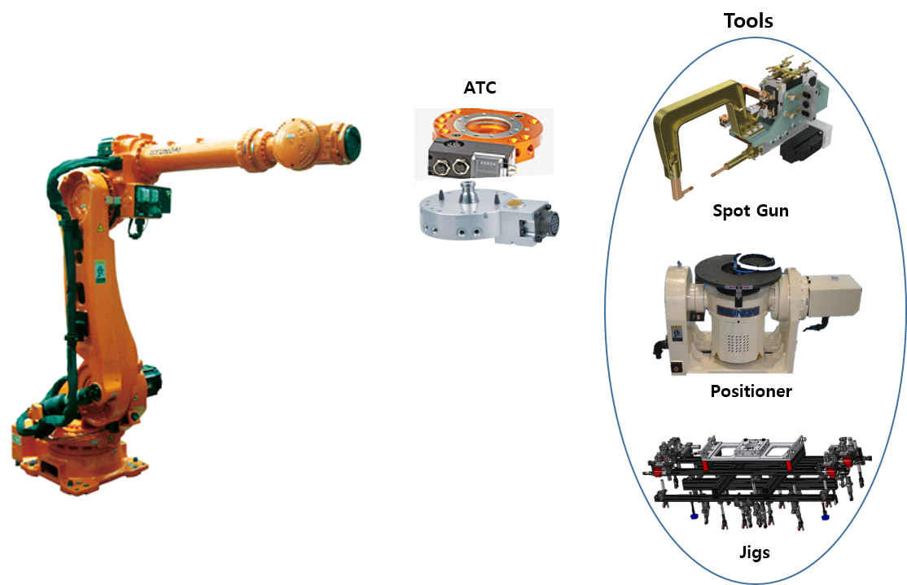
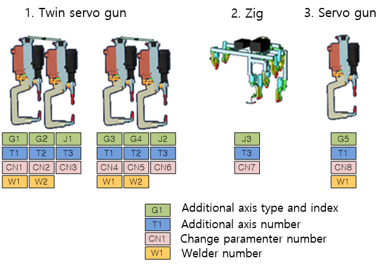

# 1.1 What is Multi (Servo) Tool Change?

Servo tool change refers to the process in which the robot automatically replaces tools—such as jigs, positioners, or servo guns equipped with servo motors—using an Automatic Tool Changer (ATC).

 </img>
 <em>
Figure 1.1 Servo Tool and Robot
</em>

This manual is written based on a system equipped with three additional axes: the first axis is used for three positioners, the second axis is used for three servo guns, and the third axis is used for two servo guns, all of which are exchanged and operated via an ATC. The actual system installed on site may differ, so operators must refer to this manual and apply the procedures according to the specifications of the on-site equipment.

<b>
<!--
## System Specifications Covered in This Manual

 </img>
 <em>
Figure 1.2 Types of Servo Tools Covered in This Manual
</em>

-->

 

   
 - Required reference document  
    -	[${cont_model} Robot Controller Operation Manual](https://hrbook-hrc.web.app/#/view/doc-hi6-operation/english-Hi6-tp630/README)  
    -	[${cont_model} Robot Controller Operation Manual - Additional axes](https://hrbook-hrc.web.app/#/view/doc-add-axes/english/README)   
    -   [${cont_model} Functional Manual - Positioner Sync.](https://hrbook-hrc.web.app/#/view/doc-positioner-sync/english/README)  
    -	[${cont_model} Robot Controller Function Manual - Spot Welding](https://hrbook-hrc.web.app/#/view/doc-spot-weld/english/README)

