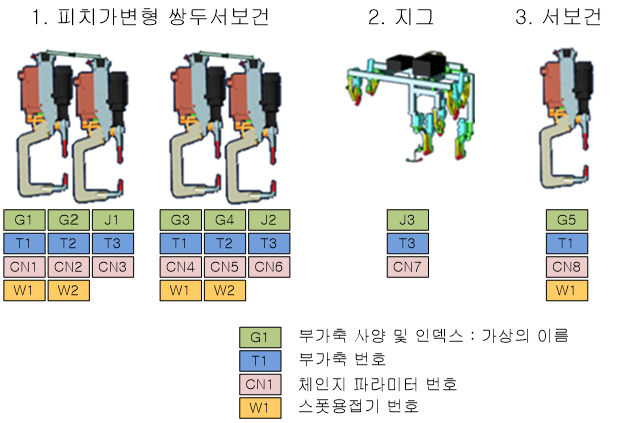

# 1.1 멀티 (서보)툴 체인지란?

서보 모터가 부착된 두 개 이상의 툴(지그, 포지셔너, 서보건 등)에 대하여 툴 체인저(ATC)를 이용하여 로봇이 자동으로 툴을 교체하는 행위를 말합니다.

 </img>
 <em>
그림 1.1 서보툴과 로봇
</em>

본 설명서에서는 
 - 6축 로봇
 - 부가축 1 (a1) : 포지셔너 (포지셔너 3개 툴체인지)
 - 부가축 2 (a2) : 서보건 (서보건 3개 툴체인지)
 - 부가축 3 (a3) : 서보건 (서보건 2개 툴체인지)  

 총 9축으로 구성된 가상의 시스템을 기반으로 설명을 진행합니다. 현장에서 사용하는 시스템이 이와 동일할 수는 없으므로 본 설명서의 내용을 참고하여 현장 시스템에 맞게 사용하십시오.

<!--
## 설명서에서 다루는 시스템 사양

 </img>
 <em>
그림 1.2 설명서에서 다루는 서보툴의 종류
</em>

-->

 

   
 - 필수설명서  
    -	[${cont_model} 로봇제어기 조작설명서](https://hrbook-hrc.web.app/#/view/doc-hi6-operation/ko-tp630/README?cont_model=${cont_model})  
    -	[${cont_model} 로봇제어기 기능설명서 - 부가축](https://hrbook-hrc.web.app/#/view/doc-add-axes/ko/README?cont_model=${cont_model})   
    -   [${cont_model} 로봇제어기 기능설명서 - 포지셔너동기](https://hrbook-hrc.web.app/#/view/doc-positioner-sync/ko/README?cont_model=${cont_model})  
    -	[${cont_model} 로봇제어기 기능설명서 - 스폿 용접](https://hrbook-hrc.web.app/#/view/doc-spot-weld/ko/README?cont_model=${cont_model})

