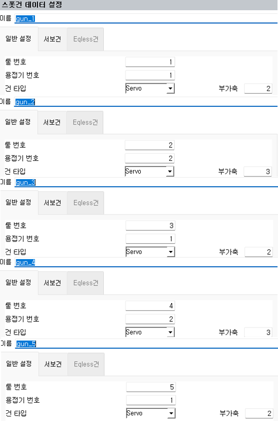

# 1.3 Operation Workflow

To use the Servo Tool Change function, the system must be initialized and configured to a level that supports auxiliary axes.
Based on the system specifications covered in this manual, the workflow—from system initialization to user program creation—is summarized in the table below.

| Step | Configuration | Description | Detailed Setting Path |Notes|
| :---: | :---: | :---: |:---:  |:---:|
| 1 | [System Initialization](https://hrbook-hrc.web.app/#/view/doc-hi6-operation/english-tp630/7-setting/6-initialization/README) | Perform system initialization |[**system**/5:Intialization/1:System format] ||
| 2 | Robot Type Selection| Register robot type and number of additional axes |[**system**/5:Intialization/2:Robot type selection] |Number of additional axes: 3|
| 3 | Rebooting |  | ||
| 4 | Additional Axis Parameter Setup | Register additional axis information |[**system**/5:Intialization/5:Additional axis parameter setting] |Default setup: T1 = G1, T2 = G2, T3 = J1|
| 5 | Rebooting |  | ||
| 6 | Application Settings | Configure application settings, I/O signals, and user key assignments |[**system**/5:Intialization/3:Usage setting] |Spot welding usage, user key assignment|
| 7 | Encoder Offset Setup | Register encoder origin |[**system**/3: Robot Parameters → 4: Encoder Offset] ||
| 8 | [Axis Origin Setup](https://hrbook-hrc.web.app/#/view/doc-hi6-operation/english-tp630/7-setting/4-robot-parameter/2-axis-origin) | Set the axis origin and run automatic calibration |[**system**/3: Robot Parameters → 2: Axis Origin] ||
| 9 | [*Spot Gun Setup](https://hrbook-hrc.web.app/#/view/doc-spot-weld/english/5-spot-weld-parameter/5-2-welding-gun-parameter/README) | Configure gun parameters (only for spot welding). |[**system**/4: Application Parameters → 1: Spot Welding → 2: Welding Gun Parameters] ||
| 10 | [Servo Tool Change Setup](https://hrbook-hrc.web.app/#/view/doc-svtool-change/english/README) | Configure environment settings for servo tool change |[**system**/4: Application Parameters → 11: Servo Tool Change] ||
| 11 | [Tool Data Setup](https://hrbook-hrc.web.app/#/view/doc-load-estimation/english/README) | Perform load estimation for tool attach/detach (T0) | ||
| 12 | [Positioner Calibration](https://hrbook-hrc.web.app/#/view/doc-positioner-sync/english/README) | When using a positioner for servo tool change, create calibration programs for each positioner | ||
| 13 | [Program Development](https://hrbook-hrc.web.app/#/view/doc-hi6-operation/english-tp630/3-programming/README) |  | |toolchng (attach/detach)   posi_calib (Positioner Calibration)|
| 14 | [Auto Operation](https://hrbook-hrc.web.app/#/view/doc-hi6-operation/english-tp630/2-operation/2-automatic-operation/README) |  | ||

 


- *Spot Gun Configuration (Required only when using spot welding)
    - Assign the tool number, auxiliary axis number, and welding controller number corresponding to each gun number. 
    - Servo tool parameters can be configured only for gun numbers defined in this setting.


 

 </img>
 <em>
Figure 1.3 Spot Gun Configuration
</em>

 

The configuration described above is summarized in the table below.

|Welder	|Gun number|Tool number|	Gun type	|Additional axis|
| :---: | :---: | :---: |:---:  |:---:|
|W1|**G1**|	T1|	servo gun	|T1|
|W2|**G2**|	T1|	servo gun	|T2|
|W1	|**G3**|	T2|	servo gun	|T1|
|W2	|**G4**|	T2|	servo gun	|T2|
|W1|**G5**|	T3|	servo gun	|T1|

