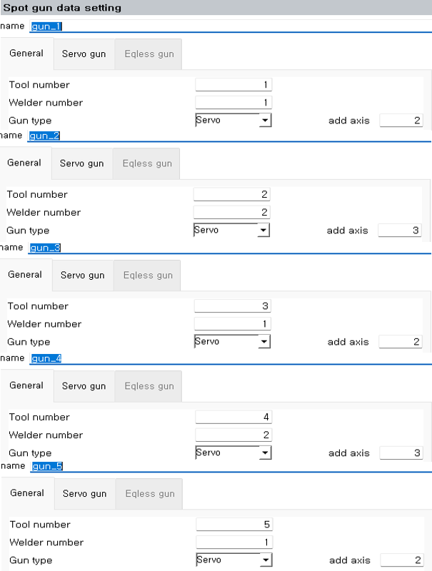

# 1.3 操作工作流程

要使用伺服工具更换功能，系统必须初始化并配置到支持附加轴的级别。根据本手册中涵盖的系统规格，从系统初始化到用户程序创建的工作流程总结在下表中。

| 步骤 | 配置 | 描述 | 详细设置路径 | 备注 |
| :---: | :---: | :---: | :---: | :---: |
| 1 | [系统初始化](https://hrbook-hrc.web.app/#/view/doc-hi6-operation/zh-tp630/7-system/6-initialization/1-system-format?cont_model=${cont_model}) | 执行系统初始化 | `system**/5:Intialization/1:System format] | |
| 2 | [机器人类型选择](https://hrbook-hrc.web.app/#/view/doc-hi6-operation/zh-tp630/7-system/6-initialization/2-robot-type-sel?cont_model=${cont_model}) | 注册机器人类型和附加轴数量 | `system**/5:Intialization/2:Robot type selection] | 附加轴数量：3 |
| 3 | 重启 |  | || 
| 4 | [附加轴参数设置](https://hrbook-hrc.web.app/#/view/doc-hi6-operation/zh-tp630/7-system/6-initialization/5-add-axis-param?cont_model=${cont_model}) | 注册附加轴信息 | `system**/5:Intialization/5:Additional axis parameter setting] | 默认设置：T1 = G1, T2 = G2, T3 = J1 |
| 5 | 重启 |  | || 
| 6 | [应用配置](https://hrbook-hrc.web.app/#/view/doc-hi6-operation/zh-tp630/7-system/6-initialization/3-usage-set/README?cont_model=${cont_model}) | 配置应用设置、I/O信号和用户按键分配 | `system**/5:Intialization/3:Usage setting] | 点焊用法，用户按键分配 |
| 7 | [编码器偏置设置](https://hrbook-hrc.web.app/#/view/doc-hi6-operation/zh-tp630/7-system/4-robot-parameter/4-encoder-offset/README?cont_model=${cont_model}) | 注册编码器起点 | `system**/3: Robot Parameters → 4: Encoder Offset] || 
| 8 | [轴起点设置](https://hrbook-hrc.web.app/#/view/doc-hi6-operation/zh-tp630/7-system/4-robot-parameter/2-axis-origin?cont_model=${cont_model}) | 设置轴起点并运行自动校准 | `system**/3: Robot Parameters → 2: Axis Origin] || 
| 9 | [*点焊枪设置](https://hrbook-hrc.web.app/#/view/doc-spot-weld/zh/5-spot-weld-parameter/5-2-welding-gun-parameter/README?cont_model=${cont_model}) | 配置枪参数（仅适用于点焊）。 | `system**/4: Application Parameters → 1: Spot Welding → 2: Welding Gun Parameters] || 
| 10 | [伺服工具更换设置](https://hrbook-hrc.web.app/#/view/doc-svtool-change/zh/README?cont_model=${cont_model}) | 配置伺服工具更换的环境设置 | `system**/4: Application Parameters → 11: Servo Tool Change] || 
| 11 | [工具数据设置](https://hrbook-hrc.web.app/#/view/doc-load-estimation/zh/README?cont_model=${cont_model}) | 执行工具附加/拆卸（T0）的负载估算 | `system**/6: Auto calibration → 4: Load Estimation] || 
| 12 | [定位器校准](https://hrbook-hrc.web.app/#/view/doc-positioner-sync/zh/2-system_settings/2-3-positioner-calibration/README?cont_model=${cont_model}) | 当使用定位器进行伺服工具更换时，为每个定位器创建校准程序 | || 
| 13 | [程序开发](https://hrbook-hrc.web.app/#/view/doc-hi6-operation/zh-tp630/3-programming/README?cont_model=${cont_model}) |  | | toolchng (附加/拆卸)   posi_calib (定位器校准) |
| 14 | [自动操作](https://hrbook-hrc.web.app/#/view/doc-hi6-operation/zh-tp630/2-operation/2-automatic-operation/README?cont_model=${cont_model}) |  | ||

 


- *点焊枪配置（仅在使用点焊时需要）
    - 分配与每个枪号对应的工具号、附加轴号和焊接控制器号。
    - 伺服工具参数仅可为此设置中定义的枪号进行配置。


 

 </img>
 <em>
图 1.3 点焊枪配置
</em>

 

上述配置总结在下表中。

| 焊机  | 枪号 | 工具号 | 枪类型 | 附加轴 |
| :---: | :---: | :---: | :---:  | :---: |
| W1 | **G1** | T1 | 伺服枪 | a2 |
| W2 | **G2** | T2 | 伺服枪 | a3 |
| W1 | **G3** | T3 | 伺服枪 | a2 |
| W2 | **G4** | T4 | 伺服枪 | a3 |
| W1 | **G5** | T5 | 伺服枪 | a2 |