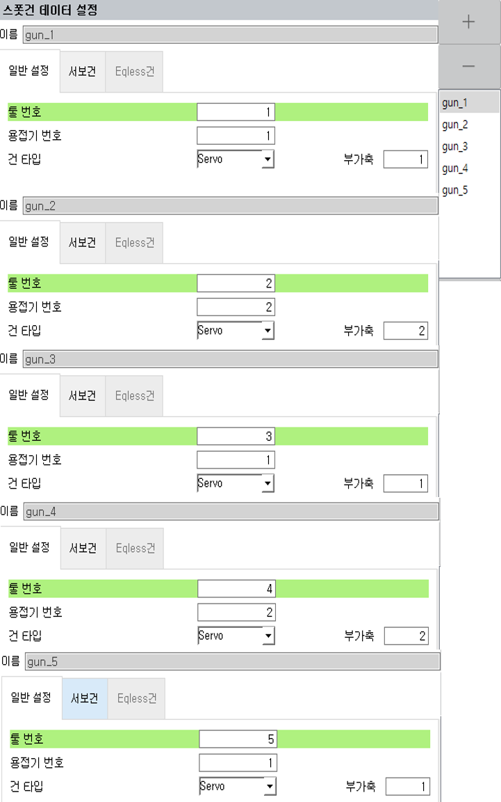

# 1.3 조작 순서

서보툴 체인지 기능을 사용하기 위해서는 부가축을 사용할 수 있는 정도의 시스템 초기화와 설정이 완료되어 있어야 합니다. 본 설명서에서 다루는 시스템 사양과 관련하여, 시스템 초기화부터 사용자 프로그램 작성까지의 작업 순서를 아래표로 설명합니다.

| 순서 | 설정 | 내용 | 상세설정 |참고|
| :---: | :---: | :---: |:---:  |:---:|
| 1 | [시스템 초기화](https://hrbook-hrc.web.app/#/view/doc-hi6-operation/korean-tp630/7-setting/6-initialization/README) | 시스템 초기화 실시 |[**시스템**/5:초기화/1:시스템 초기화] ||
| 2 | 로봇타입 선택| 로봇타입 및 부가축 개수 등록 |[**시스템**/5:초기화/2:로봇타입 선택] |부가축 개수 : 3|
| 3 | 재부팅 |  | ||
| 4 | 부가축 파라미터 설정 | 부가축 정보 등록 |[**시스템**/5:초기화/5:시스템 초기화] |T1=G1, T2=G2, T3=J1으로 초기설정|
| 5 | 재부팅 |  | ||
| 6 | 용도설정 | 작업용도설정, 입출력신호, 사용자키 할당 등 |[**시스템**/5:초기화/3:용도설정] |스폿용도, 스폿 사용자키 할당|
| 7 | 엔코더 옵셋 설정 | 엔코더 원점 등록 |[**시스템**/3:로봇 파라미터/4:엔코더 옵셋] ||
| 8 | [축 원점 설정](https://hrbook-hrc.web.app/#/view/doc-hi6-operation/korean-tp630/7-setting/4-robot-parameter/2-axis-origin) | 축 원점 설정, 자동 캘리브레이션 실행 |[**시스템**/3:로봇 파라미터/2:축 원점] ||
| 9 | [*스폿건 설정](https://hrbook-hrc.web.app/#/view/doc-spot-weld/korean/5-spot-weld-parameter/5-2-welding-gun-parameter/README) | 스폿용접의 경우 건 파라미터 설정 |[**시스템**/4:응용 파라미터/1:스폿용접/2:용접건 파라미터] ||
| 10 | [서보툴 체인지 설정](https://hrbook-hrc.web.app/#/view/doc-svtool-change/korean/README) | 서보툴 체인지를 위한 환경 설정 |[**시스템**/4:응용 파라미터/11:서보툴 체인지] ||
| 11 | [툴 데이터 설정](https://hrbook-hrc.web.app/#/view/doc-load-estimation/korean/README) | 툴의 분리(T0)와 접속에 따른 부하추정 수행 | ||
| 12 | [포지셔너 캘리브레이션 수행](https://hrbook-hrc.web.app/#/view/doc-positioner-sync/korean/README) | 포지셔너를 이용한 서보툴 체인지인 경우 각각의 포지셔너 별로 캘리브레이션 프로그램 작성 | ||
| 13 | [프로그램 작성](https://hrbook-hrc.web.app/#/view/doc-hi6-operation/korean-tp630/3-programming/README) |  | |toolchng (접속/분리)   posi_calib (포지셔너 캘리브레이션)|
| 14 | [자동 운전](https://hrbook-hrc.web.app/#/view/doc-hi6-operation/korean-tp630/2-operation/2-automatic-operation/README) |  | ||

 


- *스폿건 설정 (스폿 용접의 경우에만 설정)  
    - 각 건번호에 대응하는 툴 번호, 부가축 번호, 용접기 번호를 모두 지정합니다.  
    - 본 항목에서 설정된 건 번호에 대해서만 서보툴 체인지에서 서보툴 파라미터 지정이 가능합니다.


 

 </img>
 <em>
그림 1.3 스폿 건별 설정
</em>

 

위 설정을 요약하면 아래 표와 같습니다.

|용접기	|건번호|툴번호|	건타입	|부가축|
| :---: | :---: | :---: |:---:  |:---:|
|W1|**G1**|	T1|	서보건	|T1|
|W2|**G2**|	T1|	서보건	|T2|
|W1	|**G3**|	T2|	서보건	|T1|
|W2	|**G4**|	T2|	서보건	|T2|
|W1|**G5**|	T3|	서보건	|T1|

