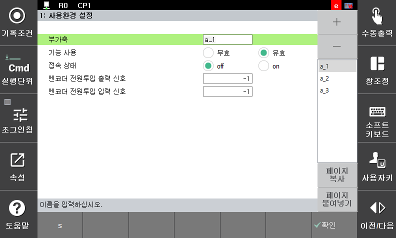

# 2.1 사용환경 설정

서보툴에 대한 체인지 환경을 설정합니다.

『시스템』 → 『4: 응용 파라미터』 → 『11: 서보툴 체인지』 → 『1: 사용환경 설정』

 </img>
 <em>
그림 2.1 서보툴 체인지 사용환경 설정
</em>

- 서보툴 체인지 기능   
부가축에 대한 체인지 기능의 사용여부를 설정합니다.  

- 서보툴 접속 상태  
현재 서보툴의 접속 또는 분리 상태를 모니터링합니다. 또한, 현재 서보툴이 접속된 경우에는 강제로 분리할 수 있으며 이를 위해서는 모터 Off 상태에서 **Off**로 변경한 후, 제어기 전원을 재투입하면 됩니다. 이와 반대로 서보툴이 분리된 경우에 강제 접속은 불가합니다.  

- 엔코더 전원투입 출력신호  
접속 또는 분리 시 엔코더 전원 제어를 위한 출력 신호를 할당합니다. 이 신호가 On인 경우 엔코더 5V전원선을 제어하는 릴레이가 동작합니다.  
	
- 엔코더 전원투입 입력신호  
접속 또는 분리 시 엔코더 전원 제어 상태를 확인하기 위한 입력 신호를 할당합니다. 엔코더 5V 전원선을 제어하는 릴레이의 동작 여부를 확인합니다.  


-	입출력 신호의 논리는 『시스템』 → 『2: 제어 파라미터』 → 『2: 입출력 신호 설정』 → 『1: 입력 신호 속성』/『2: 출력 신호 속성』에서 설정할 수 있습니다.
-	시스템 입출력 신호중 사용자 신호는 각각 SI[48~51]/SO[48~51]로 대응됩니다.


 

## 2.1.1 엔코더 리셋
최초 서보툴 장착 시 서보툴의 엔코더 리셋을 수행해야 접속이 가능합니다. 엔코더 리셋 절차는 아래와 같습니다.

  1. 서보툴 체인지 사용 설정
  2. [R359](https://hrbook-hrc.web.app/#/view/doc-${cont_model}-operation/korean-tp630/8-r-code/14-r359) + '1' 입력으로 엔코더 전원 인가 
  3. [엔코더 리셋](https://hrbook-hrc.web.app/#/view/doc-${cont_model}-operation/korean-tp630/7-system/6-initialization/4-serial-encoder-reset) 수행
  4. [R359](https://hrbook-hrc.web.app/#/view/doc-${cont_model}-operation/korean-tp630/8-r-code/14-r359) + '0' 입력으로 엔코더 전원 해제


엔코더 리셋 미수행 상태에서 서보툴 체인지 접속시 엔코더 관련 에러 발생합니다.
