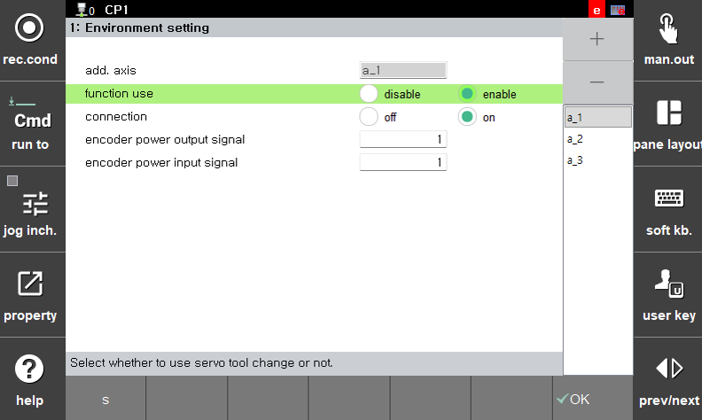

# 2.1 环境设置

伺服工具更换环境设置必须在使用前进行配置。

`[F2: 系统] - 4: 应用参数 - 11: 伺服工具更换 - 1: 环境设置 ([F2: system] - 4: Application parameter - 11: Servo tool change - 1: Environment setting)`

 </img>
 <em>
图 2.1 伺服工具更换环境设置
</em>

- 功能使用  
启用或禁用额外轴的工具更换功能。

- 连接  
监测伺服工具的当前状态（连接或分离）。  
如果工具当前已连接，可以强制分离。  
为此，在电机关闭的情况下，将状态切换为“关”，然后循环控制器电源。  
当工具被分离时，不支持强制连接。

- 编码器电源输出信号  
分配用于在工具连接或分离期间控制编码器电源的输出信号。  
当该信号为“开”时，控制5V编码器电源的继电器被激活。

- 编码器电源输入信号  
分配用于验证工具连接或分离期间编码器电源控制状态的输入信号。  
该输入监测控制5V编码器电源的继电器是否正常工作。

 


- I/O信号逻辑可以在以下位置配置：  
`[F2: 系统] - 2: 控制参数 - 2: I/O信号设置 - 1: 输入信号属性 - 2: 输出信号属性 ([F2: System] - 2: Control Parameters - 2: I/O Signal Settings - 1: Input Signal Attributes - 2: Output Signal Attributes)`

- 在系统I/O信号中，用户定义信号分配如下：  
SI[48-51] / SO[48-51]


 

**编码器重置**

在首次安装伺服工具前，必须执行编码器重置才能连接工具。  
编码器重置程序如下：

  1. 启用伺服工具更换（选中“启用”单选按钮）  
  2. [R359](https://hrbook-hrc.web.app/#/view/doc-hi6-operation/en-tp630/8-r-code/14-r359?cont_model=${cont_model}) + '1' → 编码器电源开启  
  3. [编码器重置](https://hrbook-hrc.web.app/#/view/doc-hi6-operation/en-tp630/7-system/6-initialization/4-serial-encoder-reset?cont_model=${cont_model})  
  4. [R359](https://hrbook-hrc.web.app/#/view/doc-hi6-operation/en-tp630/8-r-code/14-r359?cont_model=${cont_model}) + '0' → 编码器电源关闭  

如果在未执行编码器重置的情况下连接伺服工具，将会发生与编码器相关的错误。
