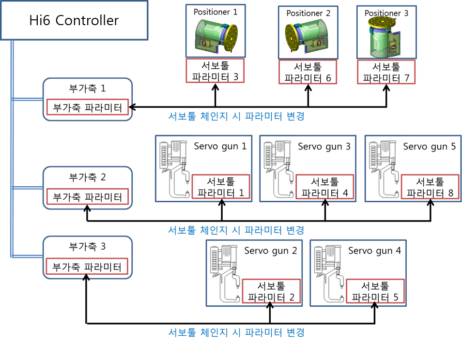

# 2.2 서보툴 파라미터 설정

각 서보모터에 대해 축 사양과 서보툴의 번호, 그리고 체인지시 부가축 번호를 관리합니다. 
『[F2]: 시스템』 → 『4: 응용 파라미터』 → 『11: 서보툴 체인지』 → 『2: 서보툴 파라미터 설정』

 </img>
 <em>
그림 2.2 서보툴 파라미터 설정
</em>

-	축 사양
체인지 축의 사양을 선택합니다. <서보건, 포지셔너, 지그> 중 하나로 선택 가능합니다.

-	축 구성 
체인지 축의 축구성이 직동인지 회전인지 선택합니다.

-	서보건/포지셔너/지그 번호 
축사양에 대한 번호를 설정합니다.
서보툴 파라미터와 서보건/포지셔너/지그 번호는 1:1 대응해야 합니다. 따라서 서로 다른 서보툴 파라미터에 동일한 서보건/포지셔너/지그 번호를 중복하여 설정할 수 없습니다.
더 이상 설정할 서보툴이 없는 경우 0번을 설정하면 됩니다.

-	부가축 번호 
접속/분리 시 제어할 부가축의 번호를 지정합니다. 축사양이 서보건이면 ‘건번호 대응 툴번호 지정’에서 설정된 부가축 번호가 자동으로 지정됩니다. 포지셔너/지그 축인 경우에는 사용자가 설정합니다. 하나의 부가축에 여러 개의 포지셔너/지그를 체인지하는 경우 체인지 할 포지셔너의 수만큼 서보툴 파라미터를 등록합니다.

※	사용 예시  
다음의 설정은 각 서보툴 별 사용하는 축 사양과 서보건/포지셔너/지그번호, 부가축 번호를 나타냅니다.
-	P1, P2, P3: 부가축 1번에 체인지하는 서보툴
-	G1, G3, G5: 부가축 2번으로 체인지하는 서보툴
-	G2, G4: 부가축 3번으로 체인지하는 서보툴

 

|체인지 대상|축 사양|축 구성|서보건/지그 번호|부가축 번호|
| :---: | :---: | :---: |:---: |:---:|
|1번 서보툴|서보건|직동|G1|2|
|2번 서보툴|서보건|직동|G2|3|
|3번 서보툴|포지셔너|회전|P1|1|
|4번 서보툴|서보건|직동|G3|2|
|5번 서보툴|서보건|직동|G4|3|
|6번 서보툴|포지셔너|회전|P2|1|
|7번 서보툴|포지셔너|회전|P3|1|
|8번 서보툴|서보건|직동|G5|2|

 

실제 서보툴 체인지 시스템 상에서 부가축 및 서보툴의 파라미터 적용 관계는 다음 그림과 같습니다.

 </img>
 <em>
그림 2.3 부가축과 툴체인지 대상
</em>

