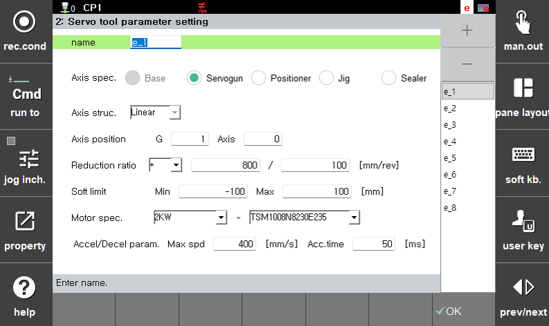
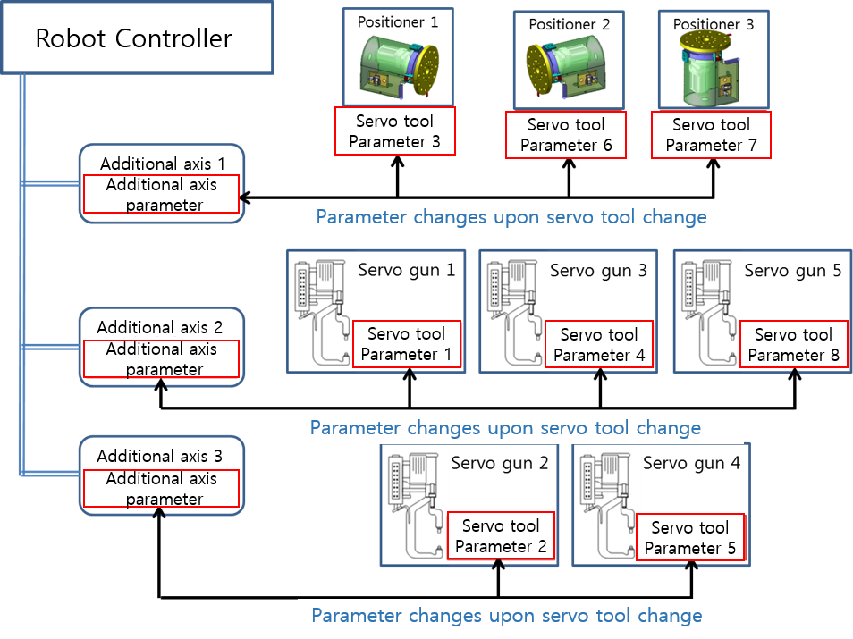

# 2.2 伺服工具参数设置

对于每个伺服电机，系统管理轴规格、分配的伺服工具编号和在工具更换操作中使用的附加轴编号。
导航路径：
`[F2: 系统] - 4: 应用参数 - 11: 伺服工具更换 - 2: 伺服工具参数设置 ([F2: System] - 4: Application Parameters - 11: Servo Tool Change - 2: Servo Tool Parameter Settings)`

 </img>
 <em>
图 2.2 伺服工具参数设置
</em>

- 轴类型  
选择工具更换轴的规格。  
选项：伺服枪、定位器、夹具

- 轴运动类型  
选择轴是否以线性或旋转运动操作。

- 伺服枪 / 定位器 / 夹具编号  
根据选择的轴类型分配相应的编号。  
伺服工具参数必须与此编号进行1:1映射。  
因此，相同的编号不能用于不同的伺服工具参数集。  
如果不需要配置额外的伺服工具，请将此值设置为0。

- 附加轴编号  
指定用于连接和断开的附加轴编号。  
如果轴类型为伺服枪，附加轴编号将根据在枪编号分配中设置的值自动分配。  
对于定位器或夹具轴，用户必须手动分配此编号。  
如果需要，可以在单个附加轴上配置多个定位器或夹具。

 

* 示例用法  
以下配置显示每个伺服工具的轴类型、分配的伺服枪/定位器/夹具编号以及相应的附加轴编号。

  - P1, P2, P3：分配给附加轴1的伺服工具

  - G1, G3, G5：分配给附加轴2的伺服工具

  - G2, G4：分配给附加轴3的伺服工具

 

|工具更换目标|轴类型|运动类型|伺服枪 / 夹具编号|附加轴编号|
| :---: | :---: | :---: |:---: |:---:|
|伺服工具 #1|伺服枪|线性|G1|2|
|伺服工具 #2|伺服枪|线性|G2|3|
|伺服工具 #3|定位器|旋转|P1|1|
|伺服工具 #4|伺服枪|线性|G3|2|
|伺服工具 #5|伺服枪|线性|G4|3|
|伺服工具 #6|定位器|旋转|P2|1|
|伺服工具 #7|定位器|旋转|P3|1|
|伺服工具 #8|伺服枪|线性|G5|2|

 

在实际的伺服工具更换系统中，附加轴和伺服工具参数之间的关系如下图所示。

 </img>
 <em>
图 2.3 附加轴和工具更换目标
</em>

