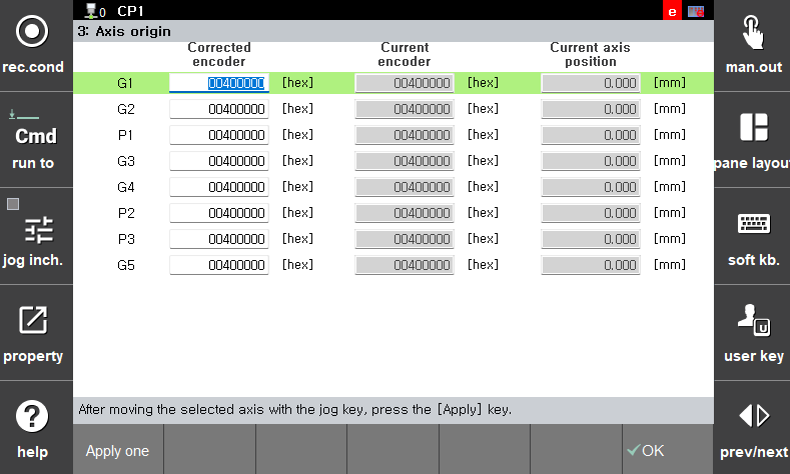

# 2.3 Axis Origin

The system manages the axis home position for each servo motor. 

Navigation path:
`[F2: System] - 4: Application Parameters - 11: Servo Tool Change - 3: Axis Home Position`

 </img>
 <em>
Figure 2.4 Servo Tool Axis Home Position Settings
</em>

 

When a servo tool is connected, the home position of the corresponding additional axis is automatically updated to the home position assigned to the selected servo tool.
In other words, the values configured under:
`[F2: System] - 4: Application Parameters - 11: Servo Tool Change - 3: Axis Home Position`
are automatically applied to:
`[F2: System] - 3: Robot Parameters - 2: Axis Home Position`.

In addition to the axis home position, the following parameters are also automatically updated to the values assigned to the connected servo tool:

- Soft limit of the corresponding additional axis  

- Encoder offset  

- Servo parameters  

- Acceleration/deceleration parameters