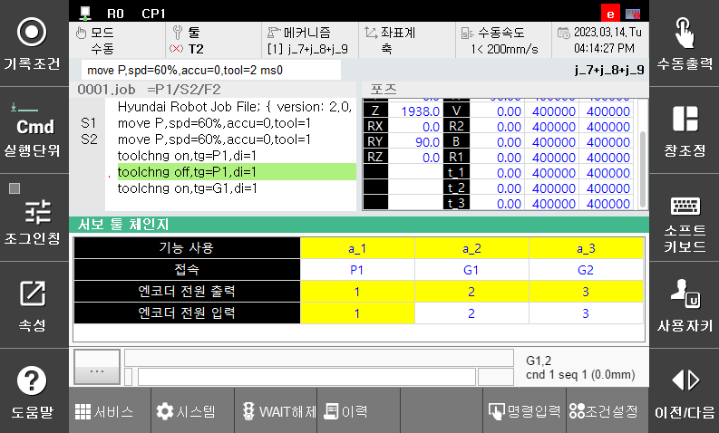

# 2.4 모니터링

서보툴 체인지 관련 상태를 사용자에게 모니터링 합니다.

『창조정』 → 『선택』 → 『서보툴 체인지』

 </img>
 <em>
그림 2.5 서보툴 체인지 모니터링
</em>

 

-	서보툴 체인지 기능  
부가축에 대한 서보툴 체인지 기능의 사용여부를 표시합니다.
 
-	서보툴 접속 상태  
부가축에 대한 서보툴 접속/분리 상태를 표시합니다. 접속인 경우 체인지 대상이 표시되며, 분리인 경우 “--”이 표시됩니다.

-	엔코더 전원투입 출력  
엔코더 전원투입을 위한 출력신호 번호와 함께 출력 상태를 표시합니다.

-	엔코더 전원투입 입력  
엔코더 전원투입을 위한 입력신호 번호와 함께 입력 상태를 표시합니다.

 


-	입출력 신호의 논리는 『시스템』 → 『2: 제어 파라미터』 → 『2: 입출력 신호 설정』 → 『1: 입력 신호 속성』/『2: 출력 신호 속성』에서 설정할 수 있습니다.

-	TBIO 신호는 48~51번으로 입력하여 설정 가능합니다.

