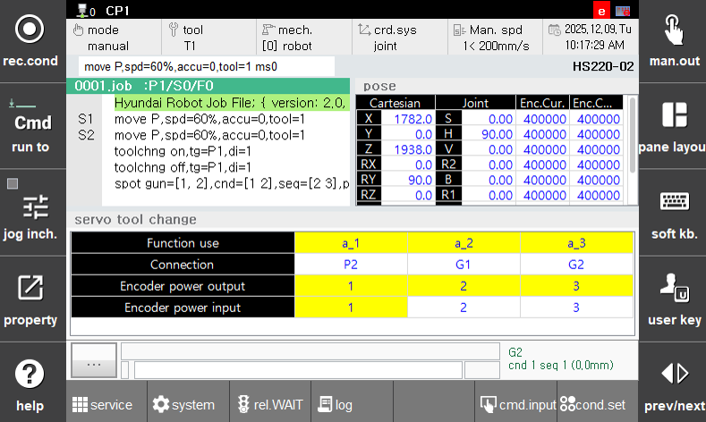

# 2.4 Monitoring

The status related to the Servo Tool Change function can be monitored by the user.

Menu Path:
『Operation Panel』 → 『Select』 → 『Servo Tool Change』

 </img>
 <em>
Figure 2.5 Servo Tool Change Monitoring Screen
</em>

 

- Servo Tool Change Function  
Displays whether the servo tool change function is enabled for the additional axis.

- Servo Tool Connection Status  
Indicates the current connection state of the servo tool on the additional axis.
If the tool is connected, the corresponding tool identifier is displayed.
If disconnected, “--” is shown.

- Encoder Power Output  
Displays the assigned output signal number used for encoder power control as well as its ON/OFF status.

- Encoder Power Input  
Displays the assigned input signal number used to monitor the encoder power state along with its ON/OFF status.

 


- The logic level of input/output signals can be configured in:

『System』 → 『2: Control Parameters』 → 『2: I/O Signal Settings』 →
『1: Input Signal Attributes』 / 『2: Output Signal Attributes』

- System I/O signals for user mapping correspond to SI[48–51] / SO[48–51].


