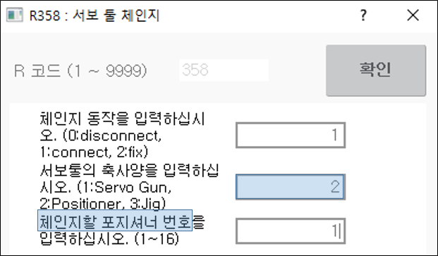
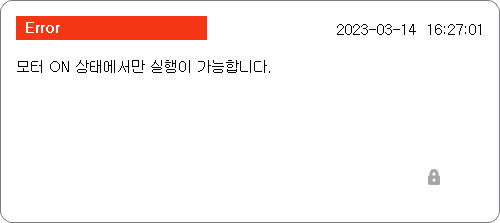
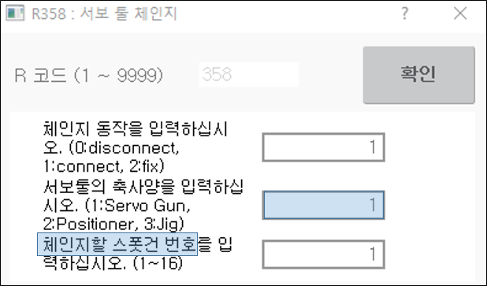
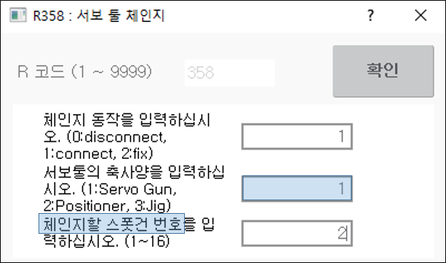

# 2.6 수동 접속/분리 기능

서보툴을 수동상태에서 접속/분리하는 기능입니다. 서보툴 수동 접속/분리는 ‘[R..]+358’을 입력하여 수행합니다. 지그/포지셔너까지 포함한 서보툴 수동 접속 분리도 ‘[R..]+358’을 입력하여 수행합니다. 본 장에서는 [2.2 서보툴 파라미터 설정](../2-user-interface/2-parameters.md) 그림2.3의 서보툴 체인지 환경의 포지셔너와 서보건 접속을 위한 R358 사용법에 대해서 설명합니다.

### (1)	포지셔너 수동 접속/분리

- 모드 스위치를 수동모드 전환하고 부가1축의 서보툴 체인지 환경을 ‘유효’로 합니다. (변경시 재부팅 필요)
- [R..]키 + 358을 입력합니다.
- 체인지 동작 입력창이 나타납니다. 접속을 위해 '1'을 입력합니다.
- 서보툴의 축사양이 포지셔너이므로 '2'를 입력합니다.
- 체인지할 포지셔너 번호 '1'을 입력합니다.
 

 </img>
 <em>
그림 2.6 포지셔너 P1 접속
</em>

 


모터 ON이 아니면 하기와 같은 메시지가 출력되고 접속/분리가 실행되지 않습니다.

 </img>
 

 



 

### (2)	서보건 수동 접속/분리

- 모드 스위치를 수동모드 전환하고 부가1축의 서보툴 체인지 환경을 ‘유효’로 합니다. (변경시 재부팅 필요)
- [R..]키 + 358을 입력합니다.
- 체인지 동작 입력창이 나타납니다. 접속을 위해 '1'을 입력합니다.
- 서보툴의 축사양이 서보건이므로 '1'를 입력합니다.
- 체인지할 서보건 번호 '1'을 입력합니다.
 

 </img>
 <em>
그림 2.8 서보건 G1 접속
</em>

 

 </img>
 <em>
그림 2.9 서보건 G2 접속
</em>

 


- 체인지 동작 입력시 ‘고정(fix)’는 실제로 툴이 교체되지 않고 서보툴 번호만 변경하기 위한 기능입니다.
- 부가축이 지그인 경우에는 축사양 입력시 '3'을 입력합니다.
- 부가축이 모든 같은 타입인 경우에는 R358 사용시 '서보툴의 축사양'에 대한 입력을 요청하지 않습니다.

