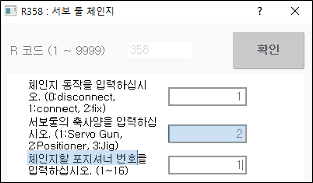
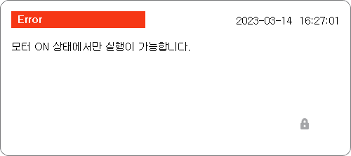
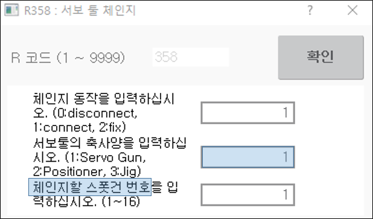
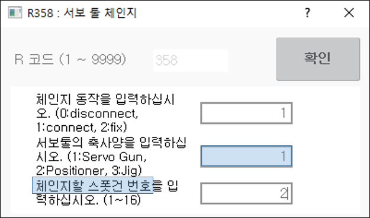

# 2.6 Manual Attach/Detach Function

Servo tools can be manually connected or disconnected while the system is in Manual Mode.
Manual servo tool change is executed by entering '[R..] + 358'.
This procedure applies to all servo tool types including jigs and positioners.

This section explains how to use the R358 manual tool change function for servo guns and positioners based on the configuration shown in [2.2 Servo Tool Parameter Settings](../2-user-interface/2-parameters.md) (Figure 2.3).

### (1) Manual Positioner Connection/Disconnection

- Switch the mode selector to Manual Mode, and enable Servo Tool Change for Auxiliary Axis 1.
(A reboot is required if system settings have been modified.)

- Press the [R..] key, then enter 358.

- The tool change command window will appear.
  Enter "1" to initiate tool connection.

- Since the tool type is a positioner, enter "2".

- Enter the target positioner number, for example "1".

 </img>
 <em>
Figure 2.6 Positioner P1 Connection
</em>

 

  
If the motor is not ON, the following message will appear and the connection/disconnection process will not be executed.

 </img>
 



 

### (2)	Manual Servo Gun Connection/Disconnection

- Switch the mode selector to Manual Mode, and enable Servo Tool Change for Auxiliary Axis 1.
(A reboot is required if the setting has been modified.)

- Press the [R..] key, then enter 358.

- When the tool change command window appears, enter "1" to execute the connection.

- Since the tool type is a servo gun, enter "1".

- Enter the servo gun number to be connected, for example "1".

 </img>
 <em>
Figure 2.8 Servo Gun G1 Connection
</em>

 

 </img>
 <em>
Figure 2.9 Servo Gun G2 Connection
</em>

 



-  When selecting "Fix" during the tool change input, the tool will not be physically changed.
 This function is used only to update the servo tool’s axis origin, soft limit, and encoder offset.
- If the auxiliary axis type is a jig, enter "3" for the axis type selection.

- If all auxiliary axes are configured with the same tool type, the system will not request input for "Tool Type" during the R358 manual operation.