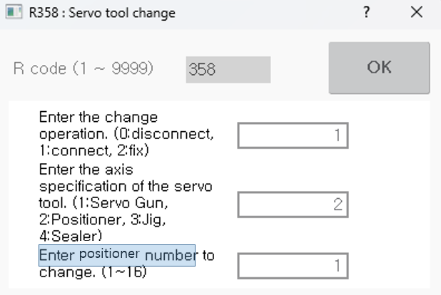
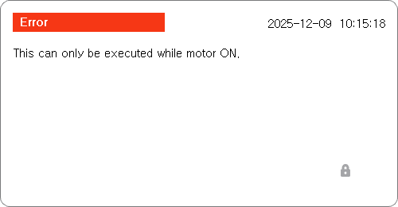
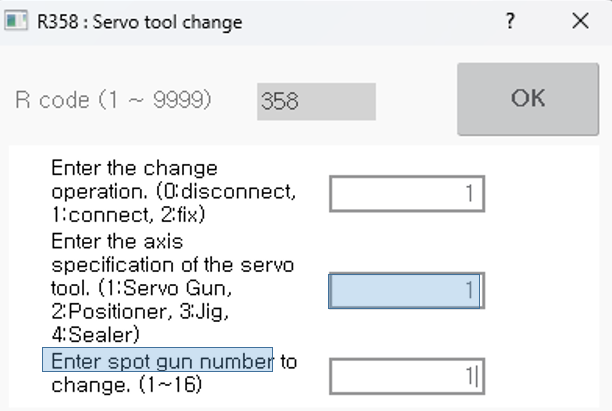
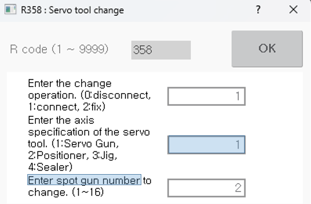

# 2.6 手动附加/分离功能

伺服工具可以在系统处于手动模式时手动连接或断开。  
手动伺服工具更换通过输入 '[R..] + 358' 来执行。  
该程序适用于所有伺服工具类型，包括夹具和定位器。

本节解释如何使用 R358 手动工具更换功能，适用于伺服枪和定位器，基于在 [2.2 伺服工具参数设置](../2-user-interface/2-parameters.md) 中显示的配置 (图 2.3)。

### (1) 手动定位器连接/断开

- 将模式选择器切换到手动模式，并启用额外轴 1 的伺服工具更换。  
（如果已修改系统设置，则需要重新启动。）

- 按下 [R..] 键，然后输入 358。

- 工具更换命令窗口将出现。  
  输入 "1" 以启动工具连接。

- 由于工具类型是定位器，输入 "2"。

- 输入目标定位器编号，例如 "1"。

 </img>
 <em>
图 2.6 定位器 P1 连接
</em>

 

  
如果电机未开启，将出现以下消息，并且连接/断开过程将不会执行。

 </img>
 



 

### (2) 手动伺服枪连接/断开

- 将模式选择器切换到手动模式，并启用额外轴 1 的伺服工具更换。  
（如果已修改设置，则需要重新启动。）

- 按下 [R..] 键，然后输入 358。

- 当工具更换命令窗口出现时，输入 "1" 以执行连接。

- 由于工具类型是伺服枪，输入 "1"。

- 输入要连接的伺服枪编号，例如 "1"。

 </img>
 <em>
图 2.8 伺服枪 G1 连接
</em>

 

 </img>
 <em>
图 2.9 伺服枪 G2 连接
</em>

 



- 在工具更换输入期间选择 "固定" 时，工具将不会被物理更换。  
此功能仅用于更新伺服工具的轴原点、软极限和编码器偏移。  
- 如果额外轴类型是夹具，请在轴类型选择中输入 "3"。  

- 如果所有额外轴都配置为相同的工具类型，系统将在 R358 手动操作期间不会请求输入 "工具类型"。