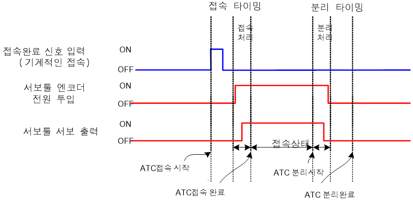

# 2.7 접속/분리 타이밍

###	접속   
접속명령(TOOLCHNG ON)을 실행중 로봇과 서보툴이 기계적으로 접속이 되면 접속완료 신호를 입력받고 제어기 내부적으로 접속 처리를 수행합니다. 또한, 서보툴축 구동을 위한 엔코더 전원 투입과 모터 ON 동작이 추가됩니다.

###	분리  
분리명령(TOOLCHNG OFF)은 접속과 상반되는 시퀀스를 가지고 분리 처리를 수행합니다.

 </img>
 <em>
그림 2.10 서보툴 체인지 접속/분리 타이밍
</em>

