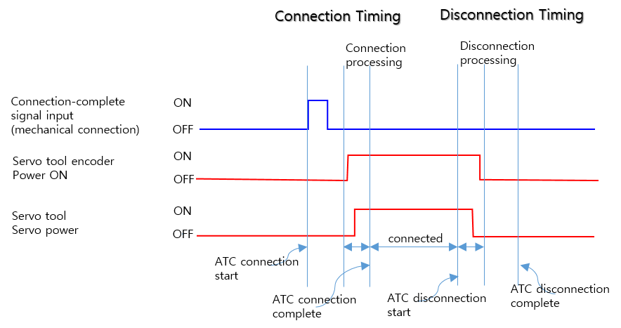

# 2.7 Attach/Detach Timing

###	Connection  

When the connection command (toolchng on) is executed and the robot and servo tool are mechanically coupled, the controller receives the connection-complete signal and performs the internal connection process.
During this sequence, the encoder power for the servo tool axis is enabled and the motor is turned ON.

###	Disconnection

The disconnection command (toolchng off) executes the reverse sequence of the connection process to remove the tool.

 

 </img>
 <em>
Figure 2.10 Servo Tool Change Connection/Disconnection Timing
</em>

