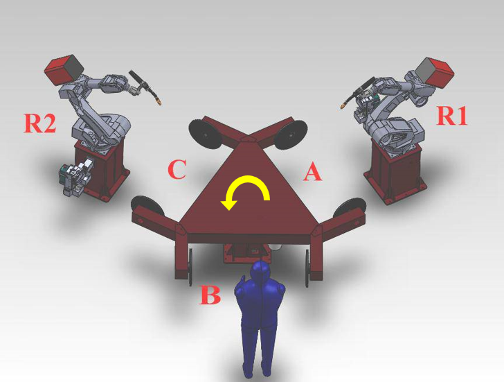

# 3.2 포지셔너의 접속/분리 예시

 </img>
 <em>
그림 3.1 로봇 2대, 포지셔너 3대 예시 (이태리 C사 시스템)
</em>

 

(1)	포지셔너 체인지 시스템의 구성
-	시스템 구성: 로봇 2대 + 포지셔너 3대
-	필요 장비: 각 포지셔너와 각각의 로봇을 연결할 수 있는 ATC(Auto Tool Changer), 당사 로봇의 서보건 체인저

(2)	작업 내용
-	로봇 1이 포지셔너 A와 접속 후 작업 수행. 로봇 2는 포지셔너 C와 작업 수행. 작업자는 포지셔너 B에 작업물 장착
-	각 포지셔너 별 작업이 종료되면 로봇과 포지셔너 간 접속을 끊음.
-	3 부분의 작업이 완료된 후 전체 포지셔너 시스템이 반시계방향으로 120도 회전.
-	로봇 1이 포지셔너 B와 접속 후 작업 수행. 로봇 2는 포지셔너 A와 작업 수행. 작업자는 포지셔너 C에 작업물 장착
-	이후 작업 반복 수행

(3)	주의 사항
-	각 포지셔너의 분리/접속 기능 동작은 가능한 한 동일한 위치에서 수행하십시오.
