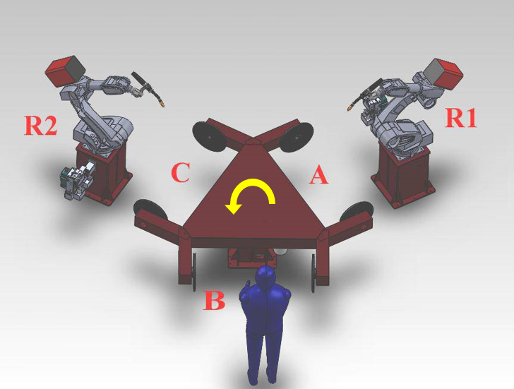

# 3.2 定位器连接/断开示例

 </img>
 <em>
图3.1 示例系统配置：两个机器人和三个定位器（意大利制造商C）
</em>

 

(1)	定位器变更系统的系统配置

- 系统布局：2个机器人 + 3个定位器

- 所需设备：

    - ATC（自动换刀装置），能够将每个定位器连接到每个机器人

    - 与我们的机器人兼容的伺服枪换装装置

(2)	操作工作流程

- 机器人1连接到定位器A并进行焊接。机器人2连接到定位器C并进行焊接。与此同时，操作员在定位器B上安装工件。

- 当每个定位器上的工作完成后，机器人与定位器之间的连接会释放。

- 在所有三个独立操作完成后，整个定位器系统逆时针旋转120°。

- 然后，机器人1连接到定位器B并开始加工。机器人2连接到定位器A。操作员在定位器C上安装一个新工件。

- 这个循环不断重复。

(3)	注意事项

尽可能在相同的定义位置执行每个定位器的断开和连接操作，以确保稳定的操作并防止机械公差错位。